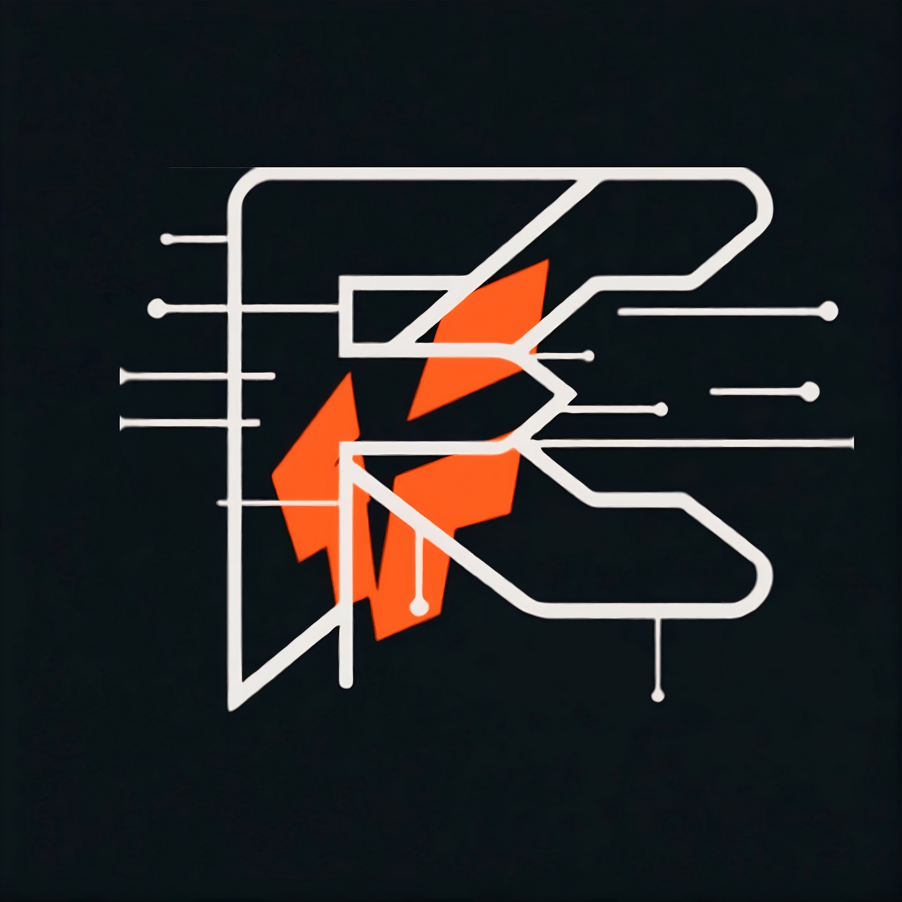

<h1>
  
  Failure Coder
</h1>
> *"Every error is just another step toward mastery."*
Welcome to **Failure Coder**! We are an open-source, community-driven tech platform dedicated to making software engineering, programming, and core computer science concepts accessible, practical, and completely free for everyone. 

We believe that failing, debugging, and rebuilding are the best ways to master technology.

---

## 📺 YouTube Channel
We regularly upload free, hands-on tutorials, project breakdowns, and developer guides.
👉 **[Watch Tutorials on YouTube](https://www.youtube.com/@Failure_Coder_easy)**

---

## 🎯 Our Mission
* **100% Free Education:** Removing barriers so anyone, anywhere can learn to build software.
* **Hands-on Building:** Shifting focus from boring syntax memorization to building production-ready projects.
* **Open Source Culture:** Encouraging developers to read code, write documentation, and contribute to public projects.
* **Embracing Failure:** Normalizing bugs, runtime errors, and stack traces as necessary steps in the learning journey.
---
## 📂 What You'll Find Here
* **Tutorial Codebases:** Production-ready source code corresponding to every YouTube project and crash course.
* **Developer Roadmaps:** Curated paths covering Web Development, Backend Architecture, and DevOps.
* **Community Open Source Projects:** Collaborative initiatives designed for first-time contributors to practice Git and pull requests.
* **Developer Cheatsheets:** Reference guides, CLI shortcuts, and interview prep kits.

  <b>Fail early, learn fast.</b> 
  Free tech education for the Failure Coder family.

